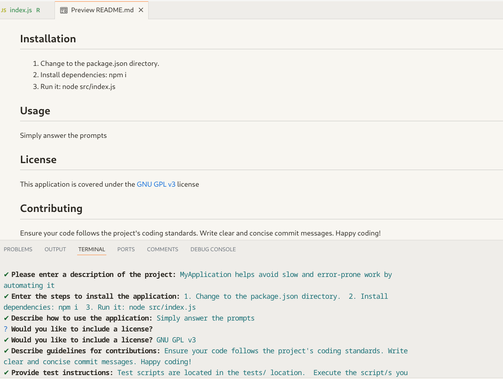

# ReadmeGen 

## Description

ReadmeGen uses nodejs and the "inquirer" dependency package to prompt you for information used to generate a README.md file for your GitHub project.

## Table of Contents

- [Installation](#installation)
- [Usage](#usage)
- [License](#license)
- [Contributing](#contributing)
- [Tests](#tests)
- [Questions](#questions)

## Installation

1. Change the project's root directory  
2. Install the dependency modules: npm install  

## Usage

1. Run: node src/index.js  
2. Answer the prompts  
3. View the generated README.md  
* See the [ReadmeGen Walkthrough](https://drive.google.com/file/d/1LaERyMDhP6-J8q0OTHyf95QkQvJzfBkp/view)  
* Here's the walkthrough [output](examples/README.md) file

## License

This application is covered under the [MIT](https://opensource.org/licenses/MIT) license

## Contributing

Guidelines:  
Ensure your code follows the project's coding standards.  
Write clear and concise commit messages.  
If your changes include new features, please update the documentation accordingly.  
If you are fixing a bug, please include a test to verify the fix.  
Thank you for your contributions!

## Tests

Test instructions:  
1. Try generating a README with license, and another that has no license (select None).  
2. For the contact questions try these account entry combinations: both, neither, github only, email only

## Questions

If you have any questions, feel free to reach out: 
- GitHub: [clintsrc](https://github.com/clintsrc)  
- Email: clinton.alan.jones@gmail.com

