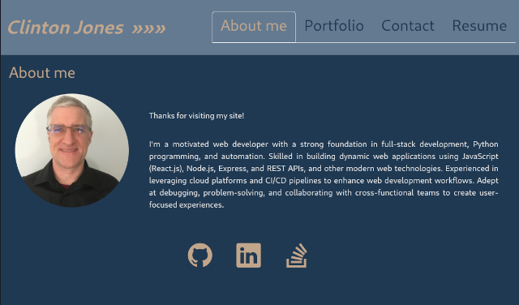

# Clinton Jones Portfolio 

## Description

My React online portfolio is a site where you can find my projects, their technologies, and a bit about my journey as a developer.

## Table of Contents

- [Installation](#installation)
- [Usage](#usage)
- [License](#license)
- [Contributing](#contributing)
- [Tests](#tests)
- [Questions](#questions)

## Installation

1. Change the project's root directory  
2. Install the dependency modules: npm install

## Usage

1. Run: npm run dev  
2. Browse to the running app at: http://localhost:3000/  
* See my active Portfolio site deployed on Netlify [here](https://clintonjones.netlify.app/)  

## License

This application is covered under the [MIT](https://opensource.org/licenses/MIT) license

## Contributing

Guidelines:  
Feel free to use the source as an example for your own site.  
Thanks to Francisco Rivera for a little help getting started with bootstrap.  
Here are some helpful resources:  
Netlify: https://www.netlify.com  
Coolers: https://coolors.co/  
Others appear in the code comments

## Tests

Test instructions:  
1. Try using valid data, invalid data, and missing data on the Contacts form submission  
2. Validate the header route links to the expected page and the color styles change accordingly.  
3. Test the footer links  
3. Test the links in each project on the Portfolio page.  
NOTE: if the active site doesn't load immediately, try again in a few minutes after the Render site spins up.

## Questions

If you have any questions, feel free to reach out: 
- GitHub: [clintsrc](https://github.com/clintsrc)  
- Email: clinton.alan.jones@gmail.com

