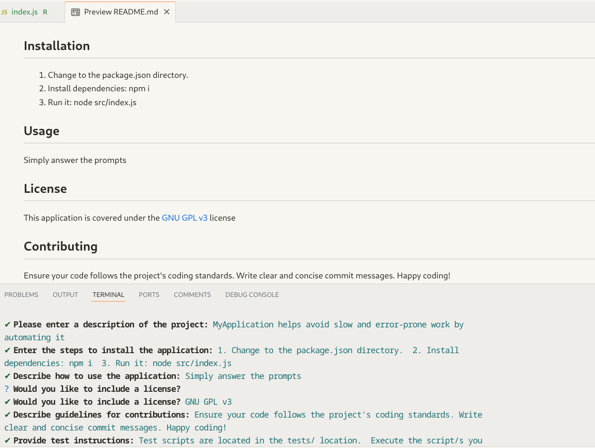

# Clinton Jones Portfolio 

## Description

My React online portfolio is a site where you can find my projects, their technologies, and a bit about my journey as a developer.

## Table of Contents

- [Installation](#installation)
- [Usage](#usage)
- [License](#license)
- [Contributing](#contributing)
- [Tests](#tests)
- [Questions](#questions)

## Installation

1. Change the project's root directory  
2. Install the dependency modules: npm install

## Usage

1. Run: npm run dev  
2. Browse to the running app at: https://localhost:3000/  
* See the active Portfolio site hosted [here](https://clintonjones.netlify.app/) on Netlify  

## License

This application is covered under the [MIT](https://opensource.org/licenses/MIT) license

## Contributing

Guidelines:  
Ensure your code follows the project's coding standards.  
Write clear and concise commit messages.  
If your changes include new features, please update the documentation accordingly.  
If you are fixing a bug, please include a test to verify the fix.  
Thank you for your contributions!

## Tests

Test instructions:  
1. Try generating a README with license, and another that has no license (select None).  
2. For the contact questions try these account entry combinations: both, neither, github only, email only

## Questions

If you have any questions, feel free to reach out: 
- GitHub: [clintsrc](https://github.com/clintsrc)  
- Email: clinton.alan.jones@gmail.com

